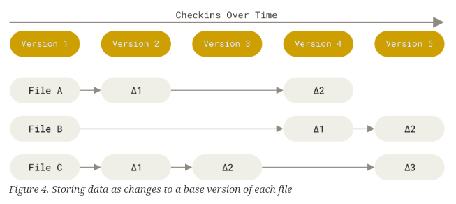
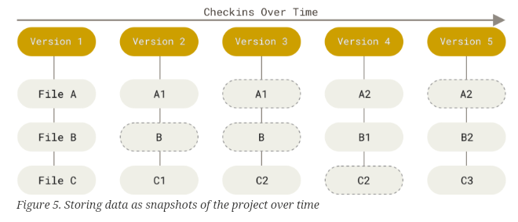
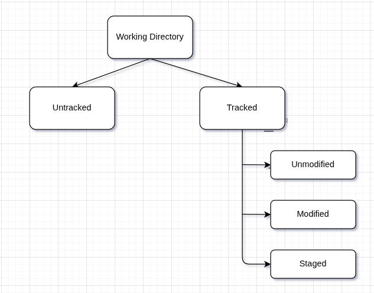

# What makes git different compared to other VSC.

Most traditional VCS store the differences (deltas) between file versions — i.e., what changed since the last update.

Git, on the other hand, takes snapshots of your entire project every time you make a commit. If a file hasn’t changed, Git simply links to the previously stored version instead of copying it again. This approach makes Git fast and efficient.

**Others :** <br>


**Git :** <br>


# The Three Main Sections of a Git Project
1. **Working Tree** — The actual files you’re currently editing.
2. **Staging Area (Index)** — The place where you prepare files for a commit.
3. **Git Directory (Repository)** — The database that stores all your project’s history and metadata.

# Configuring basic git details.
- Set up your user identity and some useful defaults:
```sh
git config --global user.name "nikhil kumar"
git config --global user.email "nikhilkumar31@outlook.com"

git config --global core.editor "code --wait"
git config --global init.defaultBranch main
```
- SSH related
```sh
# After generating SSH key and adding it to the github. We can check whether everything
# is working fine or not.
$ ssh -T git@github.com

# We can use same SSH key for commit signing
$ git config --global gpg.format ssh
$ git config --global user.signingkey ~/.ssh/<file_containing_ssh_key>.pub
$ git config --global commit.gpgsign true
```

# Getting a git repository.
There are two main ways to create a Git repository: 
1. **Initialize** a new repository in an existing directory.
2. **Clone** an existing repository from a remote source.

```sh
# Initialize a new Git repository
git init

# Cloning an existing repo
git clone <url>
```

# Recording Changes to the Repository
Every file in your working directory is either tracked or untracked.
- Tracked files are those Git knows about — they’re part of the last commit or have been staged.
- Untracked files are new files not yet added to Git.



Check the current status with:

```sh
git status
```
**Example:** Clean Working Directory
```sh
$ git status
On branch master
Your branch is up-to-date with 'origin/master'.
nothing to commit, working tree clean
```
**Example:** Untracked File
```sh
$ git status
On branch master
Your branch is up-to-date with 'origin/master'.
Untracked files:
  (use "git add <file>..." to include in what will be committed)

    README

nothing added to commit but untracked files present (use "git add" to track)
```
All untracked files appear under the “Untracked files” section.

**Example:** File Added to Staging Area
```sh
$ git status
On branch master
Your branch is up-to-date with 'origin/master'.
Changes to be committed:
  (use "git restore --staged <file>..." to unstage)

    new file:   README
```
Git shows which files are staged and the type of change (e.g., new file, modified).

**Example:** Modified Tracked File
```sh
$ git status
On branch master
Your branch is up-to-date with 'origin/master'.
Changes not staged for commit:
  (use "git add <file>..." to update what will be committed)
  (use "git checkout -- <file>..." to discard changes in working directory)

    modified:   CONTRIBUTING.md
```
These are tracked files that were changed but not yet staged.

Add files to the staging area with:
```sh
git add README.md CONTRIBUTE.md
```

# Viewing Staged and Unstaged Changes 
If we want detailed information about what changes we made inside a file or multiple files `git diff` command is used. This command compares :
1. **Working directory ↔ Staging area** (default)
2. **Working directory ↔ Last commit** (if staging area is empty)
3. **Staging area ↔ Last commit** (with --staged flag)


```sh
# Comparing woking directory files with staging area/previous commit files.

$ git diff
diff --git a/CONTRIBUTING.md b/CONTRIBUTING.md
index 8ebb991..643e24f 100644
--- a/CONTRIBUTING.md
+++ b/CONTRIBUTING.md
@@ -65,7 +65,8 @@ branch directly, things can get messy.
 Please include a nice description of your changes when you submit your PR;
 if we have to read the whole diff to figure out why you're contributing
 in the first place, you're less likely to get feedback and have your change
-merged in.
+merged in. Also, split your changes into comprehensive chunks if your patch is
+longer than a dozen lines.
```

```sh
# To comapre staging area files with previous commit we have to explicitely mentioned that

$ git difff --staged
diff --git a/README b/README
new file mode 100644
index 0000000..03902a1
--- /dev/null
+++ b/README
@@ -0,0 +1 @@
+My Project
```

# Commiting the changes
Commit your staged changes with a descriptive message:
```sh
$ git commit -m "type a commit message here !!"
```

# Removing file from Git
- To delete a file from both the repository and your working directory:

```sh
$ rm README.md CONTRIBUTE.md
$ git rm README.md CONTRIBUTE.md  

# git rm command will automatically staged the changes and make git aware that we 
# deleted some files but that does not mean we can't do the same thing some other way

$ rm README.md CONTRIBUTE.md
$ git add .
# this is also perfectly fine
```

- To remove it only from the repository but keep it locally:

```sh
$ git rm --cached README.md
```

# Renaming a file in Git
```sh
$ git mv file_from file_to
```

# Commit history
```sh
git log
```

# Undoing things
When we commit too early and possibly forget to add some files, or we mess up your commit message to undo the previous commit `git commit --amend` command is used.

```sh
$ git commit -m 'Initial commit'
$ git add forgotten_file
$ git commit --amend 
```
This replaces the previous commit with a new one.

# Unstaging a Staged file
- To unstage a file `git reset HEAD <file_name> ...` command is used.

```sh
# CONTRIBUTION.md will be removed from the staging area.
git reset HEAD CONTRIBUTION.md
```
- We can perform the similar task with `git restore --staged <file_name>` command.

```sh
git restore --staged CONTRIBUTION.md
```

# Unmodifying a Modified file
- Discard local changes and restore the last committed version:
```sh
git checkout -- <filename>
```

- We can do the same with `git restore` command.

```sh
git restore <file_name>
```

# Showing Remotes

```sh
$ git remote -v
bakkdoor  https://github.com/bakkdoor/grit (fetch)
bakkdoor  https://github.com/bakkdoor/grit (push)
cho45     https://github.com/cho45/grit (fetch)
cho45     https://github.com/cho45/grit (push)
```

# Adding Remote Repository

```sh
git remote add <short_name> <url>
```
>Note : `git clone` command implicitly adds the **origin** remote for us.

```sh
$ git remote add pb https://github.com/paulboone/ticgit

$ git remote -v
origin	https://github.com/schacon/ticgit (fetch)
origin	https://github.com/schacon/ticgit (push)
pb	https://github.com/paulboone/ticgit (fetch)
pb	https://github.com/paulboone/ticgit (push)
```

# Fetching and Pulling from Remote Repository
- `git fetch` command downloads all new data from the remote without merging it.

```sh
$ git fetch <remote> 

# After running the fetch command, we’ll have the latest information from the remote branch.
# We can now compare the differences between the local and remote repositories, review the
# changes, and once everything looks good, merge those updates into the local branch.

$ git fetch origin
$ git diff main origin/main   
$ git merge origin/main       

# NOTE : Use git fetch command when you want to review remote changes before applying them.
```

- `git pull` command fetches and automatically merges changes into your current branch (if tracking a remote branch).

```sh
$ git pull <remote> <branch> # Get what’s new and apply it to my branch

# git pull is equivalent to :
$ git fetch <remote>
$ git merge <remote>/<branch_name>
```

# Pushing to the remote 
- Pushing the local project to the remote repo

```sh
git push <remote> <local_branch>
```

# Renaming and Removing remote
```sh
# rename from pb to paul
$ git remote rename pb paul
```

```sh
# removing paul
$ git remote remove paul
```

